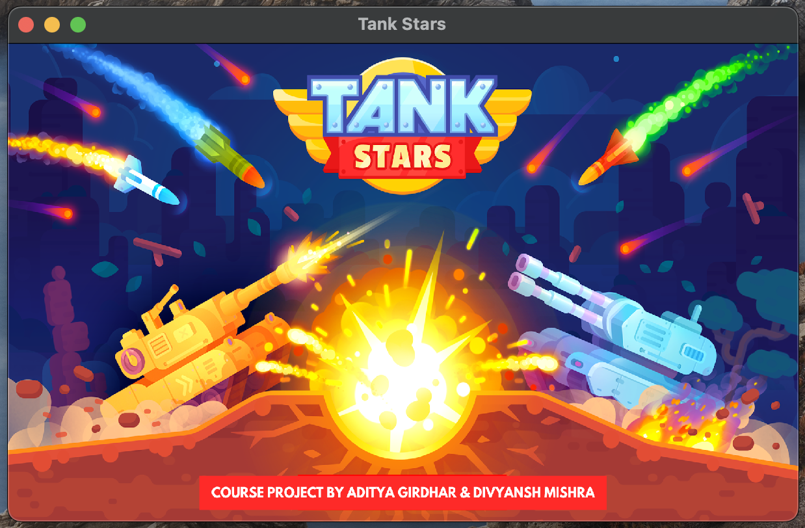
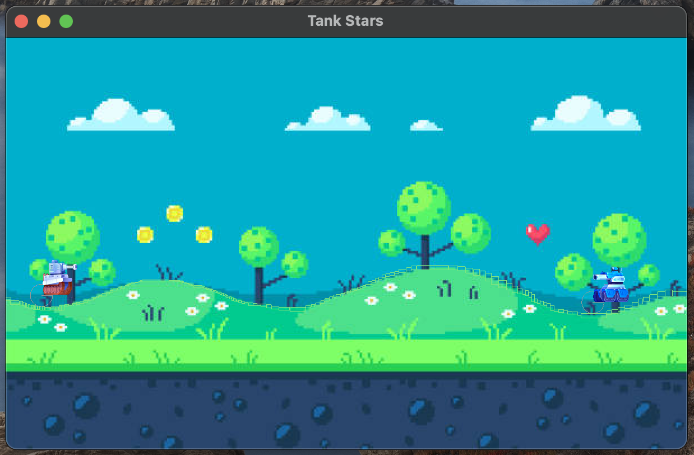

# 🎖️ Tank Stars 🪖
An adaptation of the popular video game TankStars, made using Java &amp; [libGDX](https://libgdx.com/) for the Advanced Programming course at IIIT, Delhi.

## Run the game
After installing all the necessary dependencies, go to the `Gradle` tab > tank-stars > desktop > build > other > run

## UML Diagrams & Class Relationships
All the class relationships that have been used in the following Project are being shown graphically in a UML Diagram located at

    /tank-stars/uml-class.pdf

and a sample Use Case Diagram is located at
    
    /tank-stars/uml-ucd.pdf

## Assets

All assets used to make the user interface of the game are located at

    /tank-stars/assets/

## Game screenshots

 

 

